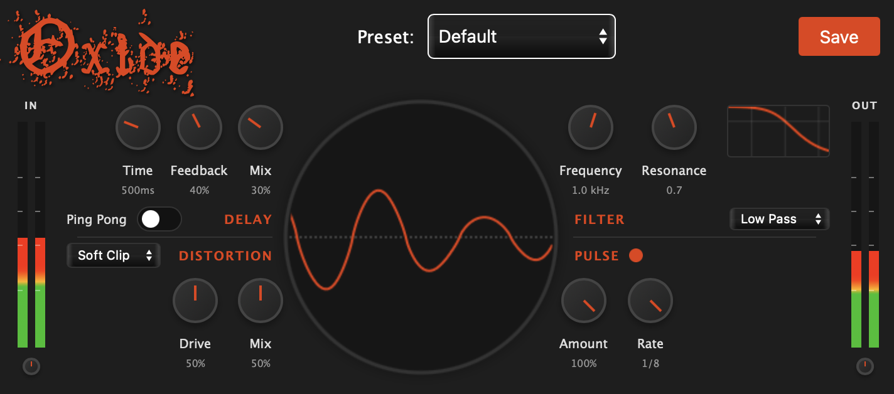

Oxide is a distorted delay plugin that combines analog-style saturation with repeating echoes; colored by five different distortion algorithms, reliable filtering, and volume pulsing effects to create unique 3D spaces in your mixes.

### Plugin Features

- 0ms latency
- Five distortion algorithms: Soft Clip, Hard Clip, Foldback, Waveshaper, and Bitcrusher
- Delaying echoes synced by frequency (hz) or note values (based on DAW bpm), options for triplet or dotted note values, ping-pong effect,
- Three filter types: Lowpass, Highpass, Bandpass with resonance control
- Time synced volume pulsing effect
- Real-time oscilloscope to display output audio
- Preset manager with ability to save and load presets
- Input/Output gain staging

### Repository

- Built in C++ with JUCE 8
- Compilation with CMake into VST3 format
- WebView Component Integration for UI
- SASS for better organization and a templated theming system

### Future

##### Tech Features

- Templated HTML
  - knockout? or some caveman simple option
  - react-juce?
  - transparent webview components?

##### Plugin Features

- Pre and post filters with variable resonance
- Modulation system with LFO and envelope follower
- Mid/Side processing with stereo width control
- compile for other formats besides vst3

## Build & Installation

1. After cloning the repository run

   ```
   git submodule add https://github.com/juce-framework/JUCE.git
   git submodule update --init --recursive
   ```

2. Build the project

   ```
   cmake -B build # first time only
   cmake --build build
   ```

3. Copy the plugin to your VST folder (Optional)

   - The project is auto copying to the default vst folder for me. I'm using a Mac but if you're on Windows it should copy to `C:\Program Files\Common Files\VST3` or Linux `~/.vst3`. If not do it manually.

---


